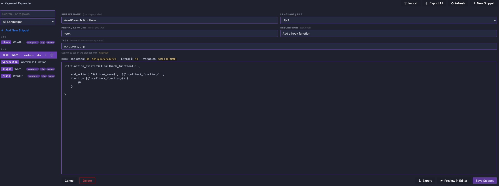

# Keyword Expander

A VS Code extension with a visual editor for creating and managing keyword shortcuts that expand into full code snippets. Reads and writes to your real VS Code snippet files — so existing snippets load automatically, new ones appear in IntelliSense straight away, and everything syncs via VS Code Settings Sync.



---

## Installation

**Option A** (clone into extensions) supports `git pull` updates and is recommended if you're developing or tweaking the extension. **Option B** (build a vsix) is better for distributing to others or installing on machines without Git. Don't use both at the same time — VS Code will see duplicate extensions.

### Option A — Clone into extensions folder (recommended for easy updates)

```bash
git clone https://github.com/westcoastdigital/keyword-expander.git ~/.vscode/extensions/simpliweb.keyword-expander
```

Then restart VS Code (or run *Developer: Reload Window*).

On Windows:

```bash
git clone https://github.com/westcoastdigital/keyword-expander.git %USERPROFILE%\.vscode\extensions\simpliweb.keyword-expander
```

### Option B — Build a `.vsix` (for distributing to others)

```bash
git clone https://github.com/westcoastdigital/keyword-expander.git
cd keyword-expander
npm install
npx vsce package
code --install-extension keyword-expander-1.0.0.vsix
```

> **Note:** The vsix install extracts files into the extensions folder — it is not a git repository. Running `git pull` inside `simpliweb.keyword-expander-1.0.0` will fail. To update a vsix install, rebuild and reinstall the vsix (see below).

### Updating

**Option A** — Pull the latest changes and reload:

```bash
cd ~/.vscode/extensions/simpliweb.keyword-expander
git pull
```

Then run *Developer: Reload Window* in VS Code.

**Option B** — Rebuild and reinstall the vsix:

```bash
cd keyword-expander
git pull
npx vsce package
code --install-extension keyword-expander-1.0.0.vsix
```

VS Code will replace the existing install automatically.

---

## Opening the editor

There are four ways to open the snippet editor — no Command Palette required:

| Where | How |
|---|---|
| **Status bar** | Click **⌨ Snippets** in the bottom-right of the VS Code window — always visible |
| **Editor title bar** | Click the **⌨** icon in the top-right corner of any open file |
| **Extensions panel** | Find *Keyword Expander* in your installed extensions, click the **⚙** gear icon, choose *Keyword Expander: Open Snippet Editor* |
| **Command Palette** | `Ctrl+Shift+P` → `Keyword Expander: Open Snippet Editor` |

---

## Browse & Insert

Press `Ctrl+Alt+K` (`Cmd+Alt+K` on Mac) to open a searchable Quick Pick of every snippet you have. Snippets are grouped by language and searchable by keyword, name, or description. Select one and it inserts directly at the cursor.

To filter by tag, type `tag:` followed by part of the tag name — e.g. `tag:woo` shows only WooCommerce-tagged snippets. You can combine a tag filter with a normal search term: `tag:woo checkout` narrows to WooCommerce snippets whose keyword or name also matches "checkout".

This is the fastest way to reference and use a snippet without remembering the exact keyword — especially useful when you have a large library.

You can also reach it from:

| Where | How |
|---|---|
| **Keyboard** | `Ctrl+Alt+K` / `Cmd+Alt+K` (when editor is focused) |
| **Editor title bar** | Click the **🔍** icon in the top-right corner of any open file |
| **Command Palette** | `Ctrl+Shift+P` → `Keyword Expander: Browse & Insert Snippet` |

To change the keybinding, open *File → Preferences → Keyboard Shortcuts* and search for `keywordExpander.browse`.

---

## Adding a snippet

1. Click **+ Add New Snippet** in the sidebar
2. Fill in the form:

| Field | Description |
|---|---|
| **Snippet Name** | Display label shown in IntelliSense (e.g. `WordPress Plugin Header`) |
| **Language / File** | Where to save it — `PHP`, `JavaScript`, `Global`, etc. |
| **Prefix / Keyword** | What you type to trigger the expansion (e.g. `plugin`) |
| **Description** | Optional detail line shown in the IntelliSense dropdown |
| **Tags** | Optional comma-separated labels for grouping and filtering (e.g. `woocommerce, php, checkout`) — not written to the snippet file, stored separately |
| **Scope** | Global snippets only — comma-separated language IDs to restrict to (blank = all languages) |
| **Body** | The content to expand into — supports full VS Code snippet syntax |

3. Click **Save Snippet** (or `Ctrl+S`)

The snippet is written immediately to your VS Code snippets directory and available in IntelliSense with no restart.

---

## Add selection as snippet

The fastest way to create a snippet from code you've already written. Select any block of code in the editor, right-click, and choose **Keyword Expander: Add Selection as Snippet**.

The snippet editor opens beside your file with the selected code pre-loaded in the Body field and the language automatically matched to the file you're working in. All that's left is to fill in the name, keyword, and any optional fields, then save.

**Step by step:**

1. Select the code you want to turn into a snippet
2. Right-click → **Keyword Expander: Add Selection as Snippet**
3. The editor panel opens with the body pre-filled
4. Enter a **Snippet Name** and **Prefix / Keyword** (the cursor lands on Name automatically)
5. Optionally add a Description and Tags
6. Click **Save Snippet** or press `Ctrl+S`

You can also trigger it via the Command Palette: `Ctrl+Shift+P` → `Keyword Expander: Add Selection as Snippet`.

> **Tip:** The Prefix field is intentionally left blank — there's no reliable way to guess a good keyword from arbitrary code, so you're always prompted to choose one.

---

## Auto Tab Stops

Once you have code in the Body field — whether typed manually or pasted via **Add Selection as Snippet** — click **⚡ Auto Tab Stops** to automatically convert it into a proper VS Code snippet with linked tab stops and placeholders.

### What it does

The button scans the body for patterns that are worth turning into tab stops and converts them in one click:

**Repeated identifiers** — if a function name, variable, or any identifier appears more than once (including inside quoted strings), all occurrences are linked to the same tab stop. Changing the placeholder once updates every instance.

**Inline comments** — `// my comment` becomes `// ${N:my comment}` so you can quickly replace placeholder comments with real code as you tab through.

**Repeated string literals** — if the same quoted string appears in multiple places, it becomes a linked tab stop so both instances stay in sync.

**Dollar signs** — any `$` in the body (PHP variables, etc.) is automatically escaped to `\$` so VS Code doesn't misinterpret it as a tab stop.

**Cursor position** — `$0` is appended at the end, placing the final cursor after all tab stops are filled.

### Example

Paste this via **Add Selection as Snippet**:

```php
function my_custom_hook() {

    // add your code here

}
add_action( 'init', 'my_custom_hook' );
```

Click **⚡ Auto Tab Stops** and the body becomes:

```php
function ${1:my_custom_hook}() {

    // ${2:add your code here}

}
add_action( 'init', '${1}' );
$0
```

`my_custom_hook` is linked — tab to `${1}` and type your function name once; both the definition and the `add_action` reference update together.

### What it won't touch

Common WordPress, WooCommerce, PHP, and JavaScript built-in function names are on a skip list and are never converted to tab stops — so `add_action`, `get_template_directory`, `esc_html`, `wc_price`, etc. pass through unchanged.

### Notes

- The button checks for existing `${N}` tab stops before running. If the body already has tab stops it will ask you to clear them first to avoid double-processing.
- Auto Tab Stops is a starting point, not a final step — review the result and tweak the tab stop numbers, placeholders, and order to match how you actually want to tab through the snippet.
- Not every snippet benefits from it. Simple single-use snippets with no repeated identifiers won't produce any tab stops and the button will tell you so.

---

## Searching & filtering

The sidebar search box and the Browse & Insert Quick Pick both support the same filter syntax.

### Text search

Typing plain text matches against the snippet's keyword (prefix), name, and body. Results update as you type.

### Language filter

Use the **All Languages** dropdown beneath the search box to restrict the list to snippets from a specific language file.

### Tag filter

Type `tag:` followed by part of a tag name to show only snippets that carry a matching tag:

| You type | Shows |
|---|---|
| `tag:woo` | Any snippet tagged with something containing "woo" (e.g. `woocommerce`, `woo-blocks`) |
| `tag:woocommerce` | Snippets tagged exactly `woocommerce` (or any tag containing that string) |
| `tag:` | All snippets that have at least one tag |

Tag matching is case-insensitive and substring-based — `tag:woo` matches `woocommerce`, `woo-blocks`, `woo`, etc.

### Combining filters

You can mix a tag filter with a text search in the same box. The tag filter is extracted first, then the remaining text is matched normally:

```
tag:woo checkout
```

This shows snippets tagged with something containing "woo" whose keyword, name, or body also contains "checkout".

The language dropdown applies on top of both — so you can filter to PHP WooCommerce checkout snippets by selecting PHP in the dropdown, then typing `tag:woo checkout` in the search box.

---

## Expanding snippets

### IntelliSense (primary)

Type your keyword in any file. It appears in the autocomplete dropdown labelled with your snippet name and description. Press **Tab** or **Enter** to expand.

This works automatically with no configuration — VS Code picks up the snippet files the extension writes to.

### Tab key (optional)

To expand by pressing **Tab** directly after a keyword (like Emmet), add this to your `keybindings.json` (`Ctrl+Shift+P` → *Open Keyboard Shortcuts JSON*):

```json
{
    "key": "tab",
    "command": "keywordExpander.expand",
    "when": "editorTextFocus && !editorReadonly && !suggestWidgetVisible && !inSnippetMode"
}
```

If the word before the cursor doesn't match any snippet, Tab falls through to normal indentation.

---

## Settings Sync

Snippets created with Keyword Expander sync automatically via [VS Code Settings Sync](https://code.visualstudio.com/docs/editor/settings-sync). This is because the extension writes directly to VS Code's own snippet files (`User/snippets/`), which Settings Sync already includes alongside your settings, keybindings, and extensions.

To enable Settings Sync: *Manage* (⚙ bottom-left) → *Settings Sync is Off* → *Turn On* → sign in with GitHub or Microsoft.

Once on, any snippet you create or edit is synced to all your machines automatically.

---

## Export & Import

Keyword Expander can export your snippets to a portable JSON file — useful for backups, moving to a new machine, or sharing a snippet collection with your team.

### Exporting

| What | How |
|---|---|
| **All snippets** | Click **↓ Export All** in the top-right of the editor panel |
| **One snippet** | Hover a snippet in the sidebar and click the **↓** icon, or open it in the form and click **↓ Export** |

VS Code's native save dialog opens so you can choose where to save the file. Exporting all snippets defaults to `keyword-expander-snippets.json`; exporting a single snippet uses the snippet name as the filename.

### Importing

Click **↑ Import** in the top-right of the editor panel and select a `.json` file previously exported from Keyword Expander. Snippets are merged into your existing collection — snippets with the same name and language file are overwritten, everything else is left untouched. The list refreshes automatically after import.

### Export file format

The export is plain JSON and easy to read or edit by hand:

```json
{
    "keywordExpander": true,
    "version": 1,
    "exported": "2025-01-15T09:30:00.000Z",
    "snippets": [
        {
            "file": "php.json",
            "name": "WordPress Plugin Header",
            "prefix": "plugin",
            "body": "<?php\n/*\nPlugin Name: ${1:My Plugin}\n...\n*/\n$0",
            "description": "Standard WP plugin file header",
            "scope": "",
            "tags": ["wordpress", "plugin", "scaffolding"]
        }
    ]
}
```

The `tags` field is omitted for snippets that have no tags. Tags are restored automatically on import.

### Import Examples

The `examples/` folder in this repository contains ready-to-use snippet packs covering every example in this README. Click **Import Examples** in the editor header to open a searchable Quick Pick of all available snippets — every snippet is pre-selected by default. Uncheck any you don't want, then press **Enter** to import the rest. The list refreshes automatically.

You can filter the Quick Pick by prefix, name, or description as you type. Snippets are grouped by file so you can identify sets at a glance.

| File | Snippets | What's inside |
|---|---|---|
| `acf.json` | 8 | `get_field`, text, image, repeater, flexible content, options, link, field group registration |
| `admin-ui.json` | 2 | Admin menu page, Settings API field |
| `ajax.json` | 2 | PHP AJAX handler (front + admin), `fetch()` JS call |
| `custom-post-types.json` | 2 | `register_post_type`, `register_taxonomy` |
| `enqueue.json` | 2 | Script with `wp_localize_script`, stylesheet |
| `hooks-filters.json` | 4 | `add_action`, `add_filter`, class-method variants, standalone filter callback |
| `meta-box-get-field-value.json` | 1 | Get a single field value with `rwmb_meta()` |
| `meta-box-register-multiple-fields.json` | 1 | Register a Meta Box with text, textarea, and image fields |
| `plugin-scaffolding.json` | 5 | Theme header, plugin header, singleton class, `abspath` guard, plugin constants |
| `theme.json` | 3 | Theme setup, register sidebar, `WP_Query` loop |
| `woocommerce.json` | 4 | Product price, shop columns, custom checkout field, save order meta |
| `wordpress-action-hook.json` | 1 | Action hook with `function_exists` guard |
| `wordpress-custom-post-type.json` | 1 | Full CPT registration with labels, supports, rewrite, menu icon |
| `wordpress-custom-taxonomy.json` | 1 | Reusable CPT helper function with `wp_parse_args` pattern |

You can import as many packs as you like — they merge, so running Import Examples again won't remove snippets already in your library. Any snippet whose name and language file match an existing one will overwrite it.

To add your own example packs, drop any Keyword Expander export file (`.json`) into the `examples/` folder. It will appear in the Quick Pick automatically next time you click **✷ Import Examples** — no code changes needed.

### Common workflows

**Backing up your snippets** — Export All, then commit the file to a Git repo or drop it in cloud storage alongside your dotfiles.

**Sharing with a teammate** — Export All (or pick individual snippets), send the file, they import it. Their existing snippets are not affected.

**Moving to a new machine** — Export All on the old machine, install Keyword Expander on the new one, then Import the file. If you use VS Code Settings Sync the snippets will already be there, but export/import is a good manual fallback.

**Building a team library** — Keep a shared `team-snippets.json` in your project or wiki repo. Anyone can import it to get the standard set of hooks, patterns, and boilerplate for the project.

---

## Body syntax

The body follows VS Code's standard [snippet format](https://code.visualstudio.com/docs/editor/userdefinedsnippets#_snippet-syntax).

| Syntax | Result |
|---|---|
| `$1`, `$2` | Tab stops — cursor jumps to each in order |
| `$0` | Final cursor position after all tab stops |
| `${1:text}` | Tab stop with placeholder text |
| `${1\|a,b,c\|}` | Tab stop with a drop-down choice |
| `\$` | Literal `$` sign — use this for PHP variables |
| `$TM_FILENAME_BASE` | Current filename without extension |
| `$CURRENT_YEAR` | Four-digit year |
| `$CURRENT_DATE` | Day of month |

---

## Examples

### Plugin scaffolding

#### PHP theme header

```
Name:     WordPress Theme Header
Prefix:   theme
Language: PHP
Body:
/**
 * Theme Name: ${1:SimpliWeb Theme}
 * Theme URI: https://github.com/westcoastdigital
 * Description:  ${2:Describe your theme here}
 * Version: ${3:1.0.0}
 * Author: SimpliWeb
 * Author URI: https://simpliweb.com.au
 * Text Domain: ${4:simpliweb}
 * Domain Path: /assets/lang
 * Tested up to: 6.4
 * Requires at least: 6.2
 * Requires PHP: 7.4
 * License: GNU General Public License v2.0 or later
 * License URI: https://www.gnu.org/licenses/gpl-2.0.html
 */
$0
```

#### PHP plugin header

```
Name:     WordPress Plugin Header
Prefix:   plugin
Language: PHP
Body:
<?php
/*
Plugin Name:  ${1:SimpliWeb Plugin}
Plugin URI:   https://gist.github.com/westcoastdigital
Description:  ${2:Describe what the plugin does here}
Version:      ${3:1.0.0}
Author:       SimpliWeb
Author URI:   https://simpliweb.com.au
License:      GPL v2 or later
License URI:  https://www.gnu.org/licenses/gpl-2.0.html
Text Domain:  ${4:simpliweb}
Domain Path:  /languages
*/

define('${5:SIMPLI_PLUGIN}_VERSION', '${3:1.0.0}');
define('${5:SIMPLI_PLUGIN}_PATH', plugin_dir_path(__FILE__));
define('${5:SIMPLI_PLUGIN}_URL', plugin_dir_url(__FILE__));

$0
```

#### Singleton plugin class

```
Name:     WordPress Singleton Class
Prefix:   wpclass
Language: PHP
Body:
<?php
if ( ! class_exists( '${1:ClassName}' ) ) :

class ${1:ClassName} {

	private static \$instance = null;

	public static function get_instance() {
		if ( null === self::\$instance ) {
			self::\$instance = new self();
		}
		return self::\$instance;
	}

	private function __construct() {
		$0
	}
}

${1:ClassName}::get_instance();

endif;
```

#### Abort if accessed directly

```
Name:     Abort if accessed directly
Prefix:   abspath
Language: PHP
Body:
if ( ! defined( 'ABSPATH' ) ) exit;
```

#### Plugin constants

```
Name:     Plugin constants
Prefix:   pluginconst
Language: PHP
Body:
define( '${1:MYPLUGIN}_VERSION',   '${2:1.0.0}' );
define( '${1:MYPLUGIN}_DIR',       plugin_dir_path( __FILE__ ) );
define( '${1:MYPLUGIN}_URL',       plugin_dir_url( __FILE__ ) );
define( '${1:MYPLUGIN}_BASENAME',  plugin_basename( __FILE__ ) );
```

---

### Hooks & filters

#### WordPress action hook

```
Name:     WordPress Action Hook
Prefix:   wphook
Language: PHP
Body:
if(!function_exists(${1:callback_function})) {

    add_action( '${2:hook_name}', '${1:callback_function}' );
    function ${1:callback_function}() {
	    $0
    }

}
```

#### add_action (class method)

```
Name:     add_action (class method)
Prefix:   addaction
Language: PHP
Body:
add_action( '${1:hook_name}', [ $this, '${2:method_name}' ]${3:, 10, 1} );
```

#### add_filter (class method)

```
Name:     add_filter (class method)
Prefix:   addfilter
Language: PHP
Body:
add_filter( '${1:hook_name}', [ $this, '${2:method_name}' ]${3:, 10, 1} );
```

#### Standalone filter callback

```
Name:     Standalone filter callback
Prefix:   wpfilter
Language: PHP
Body:
add_filter( '${1:hook_name}', '${2:my_filter}' );

function ${2:my_filter}( $${3:value} ) {
    $0
    return $${3:value};
}
```

---

### Enqueue

#### Enqueue script with localize

```
Name:     Enqueue script with localize
Prefix:   enqscript
Language: PHP
Body:
add_action( 'wp_enqueue_scripts', '${1:prefix}_enqueue_scripts' );

function ${1:prefix}_enqueue_scripts() {
    wp_enqueue_script(
        '${2:handle}',
        plugin_dir_url( __FILE__ ) . 'js/${3:script}.js',
        [ 'jquery' ],
        ${4:MY_PLUGIN_VERSION},
        true
    );
    wp_localize_script( '${2:handle}', '${5:MyPlugin}', [
        'ajaxurl' => admin_url( 'admin-ajax.php' ),
        'nonce'   => wp_create_nonce( '${6:my-nonce}' ),
    ] );
}
```

#### Enqueue stylesheet

```
Name:     Enqueue stylesheet
Prefix:   enqstyle
Language: PHP
Body:
add_action( 'wp_enqueue_scripts', '${1:prefix}_enqueue_styles' );

function ${1:prefix}_enqueue_styles() {
    wp_enqueue_style(
        '${2:handle}',
        plugin_dir_url( __FILE__ ) . 'css/${3:style}.css',
        [],
        ${4:MY_PLUGIN_VERSION}
    );
}
```

---

### AJAX

#### AJAX handler (front + admin)

```
Name:     AJAX handler (front + admin)
Prefix:   wpajax
Language: PHP
Body:
add_action( 'wp_ajax_${1:action_name}',        '${2:handle_ajax}' );
add_action( 'wp_ajax_nopriv_${1:action_name}', '${2:handle_ajax}' );

function ${2:handle_ajax}() {
    check_ajax_referer( '${3:my-nonce}', 'nonce' );

    $0

    wp_send_json_success( [] );
}
```

#### fetch() AJAX call to WordPress

```
Name:     fetch() AJAX call to WordPress
Prefix:   wpfetch
Language: JavaScript
Body:
fetch( MyPlugin.ajaxurl, {
    method: 'POST',
    headers: { 'Content-Type': 'application/x-www-form-urlencoded' },
    body: new URLSearchParams({
        action: '${1:action_name}',
        nonce:  MyPlugin.nonce,
        $0
    }),
} )
.then( r => r.json() )
.then( data => {
    if ( ! data.success ) return;
    console.log( data.data );
} );
```

---

### Custom post types

#### WordPress Custom Post Type

```
Name:     WordPress Custom Post Type
Prefix:   wpcpt
Language: PHP
Tags:     php, wordpress
Body:
/**
 * Register Custom Post Type
 */
function ${1:register_books_post_type}() {

    \$${2:labels} = array(
        'name'                  => __('${3:Books}', '${4:textdomain}'),
        'singular_name'         => __('${5:Book}', '${4}'),
        'menu_name'             => __('${3}', '${4}'),
        'name_admin_bar'        => __('${5}', '${4}'),
        'add_new'               => __('Add New', '${4}'),
        'add_new_item'          => __('Add New ${5}', '${4}'),
        'new_item'              => __('New ${5}', '${4}'),
        'edit_item'             => __('Edit ${5}', '${4}'),
        'view_item'             => __('View ${3}', '${4}'),
        'all_items'             => __('All ${3}', '${4}'),
        'search_items'          => __('Search ${3}', '${4}'),
        'not_found'             => __('No ${6:books} found.', '${4}'),
        'not_found_in_trash'    => __('No ${6} found in Trash.', '${4}'),
    );

    \$args = array(
        'label'               => __('${5}', '${4}'),
        '${2}'                => \$${2},
        'public'              => true,
        'show_ui'             => true,
        'show_in_menu'        => true,
        'show_in_rest'        => true,
        'menu_position'       => ${7:20},
        'menu_icon'           => '${8:dashicons-book}',
        'supports'            => array(
            'title',
            'editor',
            'thumbnail',
            'excerpt',
            'revisions'
        ),
        'has_archive'         => true,
        'rewrite'             => array(
            'slug'       => '${9:book}',
            'with_front' => false
        ),
        'hierarchical'        => false,
        'publicly_queryable'  => true,
        'exclude_from_search' => false,
        'query_var'           => true,
        'capability_type'     => 'post',
    );

    register_post_type('${9}', \$args);

}
add_action('init', '${1}');
```

#### WordPress Custom Taxonomy (reusable helper)

```
Name:     WordPress Custom Taxonomy
Prefix:   wptax
Language: PHP
Tags:     php, wordpress
Body:
/**
 * Register Custom Post Type Helper
 *
 * @param string $post_type CPT slug.
 * @param string $singular  Singular label.
 * @param string $plural    Plural label.
 * @param array  $args      Additional args.
 */
function ${1:custom_register_post_type}(\$${2:post_type}, \$${3:singular}, \$${4:plural}, \$args = array()) {

    \$${5:labels} = array(
        'name'               => \$${4},
        'singular_name'      => \$${3},
        'menu_name'          => \$${4},
        'add_new_item'       => "Add New {\$${3}}",
        'edit_item'          => "Edit {\$${3}}",
        'new_item'           => "New {\$${3}}",
        'view_item'          => "View {\$${3}}",
        'search_items'       => "Search {\$${4}}",
        'all_items'          => "All {\$${4}}",
        'not_found'          => "No {\$${4}} found",
        'not_found_in_trash' => "No {\$${4}} found in Trash",
    );

    \$${6:defaults} = array(
        '${5}'         => \$${5},
        'public'        => true,
        'show_in_rest'  => true,
        'has_archive'   => true,
        'supports'      => array(
            'title',
            'editor',
            'thumbnail'
        ),
        'rewrite'       => array(
            'slug' => sanitize_title(\$${4})
        ),
    );

    register_post_type(
        \$${2},
        wp_parse_args(\$args, \$${6})
    );
}

add_action('init', function () {

    ${1}(
        'book',
        'Book',
        'Books',
        array(
            'menu_icon' => '${5:dashicons-book}'
        )
    );

});
```

---

### Admin UI

#### Add admin menu page

```
Name:     Add admin menu page
Prefix:   adminpage
Language: PHP
Body:
add_action( 'admin_menu', '${1:prefix}_admin_menu' );

function ${1:prefix}_admin_menu() {
    add_menu_page(
        __( '${2:Page Title}', '${3:text-domain}' ),
        __( '${4:Menu Label}', '${3:text-domain}' ),
        'manage_options',
        '${5:page-slug}',
        '${6:render_page}',
        'dashicons-${7:admin-generic}',
        25
    );
}

function ${6:render_page}() {
    if ( ! current_user_can( 'manage_options' ) ) return;
    echo '<div class="wrap"><h1>' . esc_html( get_admin_page_title() ) . '</h1>';
    $0
    echo '</div>';
}
```

#### Register settings field

```
Name:     Register settings field
Prefix:   settings
Language: PHP
Body:
add_action( 'admin_init', '${1:prefix}_register_settings' );

function ${1:prefix}_register_settings() {
    register_setting( '${2:option_group}', '${3:option_name}' );

    add_settings_section(
        '${4:section_id}',
        __( '${5:Section Title}', '${6:text-domain}' ),
        '__return_null',
        '${2:option_group}'
    );

    add_settings_field(
        '${7:field_id}',
        __( '${8:Field Label}', '${6:text-domain}' ),
        '${9:render_field}',
        '${2:option_group}',
        '${4:section_id}'
    );
}

function ${9:render_field}() {
    $val = get_option( '${3:option_name}', '' );
    echo '<input type="text" name="${3:option_name}" value="' . esc_attr( $val ) . '">';
}
```

---

### ACF

#### get_field with fallback

```
Name:     ACF get_field with fallback
Prefix:   acfget
Language: PHP
Body:
\$${1:value} = get_field( '${2:field_name}' ) ?: '${3:default}';
```

#### Text field (escaped output)

```
Name:     ACF text field (escaped output)
Prefix:   acftext
Language: PHP
Body:
<?php if ( $${1:value} = get_field( '${2:field_name}' ) ) : ?>
    <p><?php echo esc_html( $${1:value} ); ?></p>
<?php endif; ?>
```

#### Image field

```
Name:     ACF image field
Prefix:   acfimage
Language: PHP
Body:
<?php
\$image = get_field( '${1:image_field}' );
if ( \$image ) : ?>
    "
         alt="<?php echo esc_attr( \$image['alt'] ); ?>"
         width="<?php echo esc_attr( \$image['width'] ); ?>"
         height="<?php echo esc_attr( \$image['height'] ); ?>">
<?php endif; ?>
```

#### Repeater field loop

```
Name:     ACF repeater field loop
Prefix:   acfrepeater
Language: PHP
Body:
<?php if ( have_rows( '${1:repeater_field}' ) ) : ?>
    <?php while ( have_rows( '${1:repeater_field}' ) ) : the_row(); ?>
        <?php \$${2:sub} = get_sub_field( '${3:sub_field}' ); ?>
        <div><?php echo esc_html( \$${2:sub} ); ?></div>
    <?php endwhile; ?>
<?php endif; ?>
```

#### Flexible content loop

```
Name:     ACF flexible content loop
Prefix:   acfflexible
Language: PHP
Body:
<?php if ( have_rows( '${1:flexible_field}' ) ) : ?>
    <?php while ( have_rows( '${1:flexible_field}' ) ) : the_row(); ?>

        <?php if ( is_row_layout( '${2:layout_one}' ) ) : ?>
            $0
        <?php elseif ( is_row_layout( '${3:layout_two}' ) ) : ?>

        <?php endif; ?>

    <?php endwhile; ?>
<?php endif; ?>
```

#### Options page field

```
Name:     ACF options page field
Prefix:   acfoption
Language: PHP
Body:
get_field( '${1:field_name}', 'option' );
```

#### Link field

```
Name:     ACF link field
Prefix:   acflink
Language: PHP
Body:
<?php \$link = get_field( '${1:link_field}' );
if ( \$link ) : ?>
    <a href="<?php echo esc_url( \$link['url'] ); ?>"
       target="<?php echo esc_attr( \$link['target'] ); ?>">
        <?php echo esc_html( \$link['title'] ); ?>
    </a>
<?php endif; ?>
```

#### Register field group (PHP)

```
Name:     Register ACF field group (PHP)
Prefix:   acfreg
Language: PHP
Body:
add_action( 'acf/init', '${1:prefix}_register_fields' );

function ${1:prefix}_register_fields() {
    acf_add_local_field_group( [
        'key'      => 'group_${2:unique_key}',
        'title'    => '${3:Field Group Title}',
        'fields'   => [
            [
                'key'   => 'field_${4:unique_key}',
                'label' => '${5:Field Label}',
                'name'  => '${6:field_name}',
                'type'  => '${7:text}',
            ],
        ],
        'location' => [
            [ [ 'param' => 'post_type', 'operator' => '==', 'value' => '${8:post}' ] ],
        ],
    ] );
}
```

---

### Meta Box

#### Register a meta box (multiple fields)

```
Name:     Meta Box register multiple fields
Prefix:   mbfields
Language: PHP
Tags:     metabox, custom-fields
Body:
add_filter( 'rwmb_meta_boxes', '${1:prefix}_register_meta_boxes' );

function ${1:prefix}_register_meta_boxes( \$meta_boxes ) {
    \$meta_boxes[] = [
        'title'      => '${2:Box Title}',
        'id'         => '${3:box-id}',
        'post_types' => [ '${4:post}' ],
        'fields'     => [
            [
                'id'   => '${5:text_field}',
                'name' => '${6:Text Field}',
                'type' => 'text',
            ],
            [
                'id'   => '${7:textarea_field}',
                'name' => '${8:Textarea Field}',
                'type' => 'textarea',
                'rows' => 4,
            ],
            [
                'id'   => '${9:image_field}',
                'name' => '${10:Image}',
                'type' => 'image_advanced',
            ],
        ],
    ];
    return \$meta_boxes;
}
```

#### Get a single field value

```
Name:     Meta Box get field value
Prefix:   mbget
Language: PHP
Tags:     metabox, custom-fields
Body:
\$${1:value} = rwmb_meta( '${2:field_id}' );
```

---

### WooCommerce

#### Get product price

```
Name:     WooCommerce get product price
Prefix:   wooprice
Language: PHP
Body:
global \$product;
\$price     = \$product->get_price();
\$formatted = wc_price( \$price );
```

#### Shop columns

```
Name:     WooCommerce shop columns
Prefix:   woocol
Language: PHP
Body:
add_filter( 'loop_shop_columns', '${1:prefix}_shop_columns' );

function ${1:prefix}_shop_columns() {
    return ${2:3};
}
```

#### Custom checkout field

```
Name:     WooCommerce custom checkout field
Prefix:   woocheckout
Language: PHP
Body:
add_action( 'woocommerce_after_order_notes', '${1:prefix}_checkout_field' );

function ${1:prefix}_checkout_field( \$checkout ) {
    woocommerce_form_field( '${2:field_name}', [
        'type'        => 'text',
        'class'       => [ 'form-row-wide' ],
        'label'       => __( '${3:Field Label}', '${4:text-domain}' ),
        'placeholder' => '${5:Placeholder}',
        'required'    => ${6:false},
    ], \$checkout->get_value( '${2:field_name}' ) );
}

add_action( 'woocommerce_checkout_process', '${1:prefix}_checkout_field_validate' );

function ${1:prefix}_checkout_field_validate() {
    if ( empty( \$_POST['${2:field_name}'] ) && ${6:false} ) {
        wc_add_notice( __( '${7:Please fill in this field.}', '${4:text-domain}' ), 'error' );
    }
}

add_action( 'woocommerce_checkout_update_order_meta', '${1:prefix}_save_checkout_field' );

function ${1:prefix}_save_checkout_field( \$order_id ) {
    if ( ! empty( \$_POST['${2:field_name}'] ) ) {
        update_post_meta( \$order_id, '${2:field_name}', sanitize_text_field( \$_POST['${2:field_name}'] ) );
    }
}
```

#### Save order meta

```
Name:     WooCommerce save order meta
Prefix:   woometa
Language: PHP
Body:
add_action( 'woocommerce_checkout_update_order_meta', '${1:prefix}_save_order_meta' );

function ${1:prefix}_save_order_meta( \$order_id ) {
    if ( isset( \$_POST['${2:field_name}'] ) ) {
        update_post_meta( \$order_id, '${2:field_name}', sanitize_text_field( \$_POST['${2:field_name}'] ) );
    }
}
```

---

### Theme

#### Theme setup function

```
Name:     Theme setup function
Prefix:   themesetup
Language: PHP
Body:
add_action( 'after_setup_theme', '${1:prefix}_setup' );

function ${1:prefix}_setup() {
    load_theme_textdomain( '${2:text-domain}', get_template_directory() . '/languages' );
    add_theme_support( 'title-tag' );
    add_theme_support( 'post-thumbnails' );
    add_theme_support( 'html5', [ 'search-form', 'comment-form', 'gallery', 'caption' ] );
    add_theme_support( 'customize-selective-refresh-widgets' );
    register_nav_menus( [
        'primary' => __( 'Primary Menu', '${2:text-domain}' ),
        'footer'  => __( 'Footer Menu',  '${2:text-domain}' ),
    ] );
}
```

#### Register widget area / sidebar

```
Name:     Register widget area / sidebar
Prefix:   regsidebar
Language: PHP
Body:
add_action( 'widgets_init', '${1:prefix}_widgets_init' );

function ${1:prefix}_widgets_init() {
    register_sidebar( [
        'name'          => __( '${2:Primary Sidebar}', '${3:text-domain}' ),
        'id'            => '${4:primary-sidebar}',
        'before_widget' => '<section id="%1\$s" class="widget %2\$s">',
        'after_widget'  => '</section>',
        'before_title'  => '<h2 class="widget-title">',
        'after_title'   => '</h2>',
    ] );
}
```

#### Custom WP_Query loop

```
Name:     Custom WP_Query loop
Prefix:   wploopquery
Language: PHP
Body:
\$args = [
    'post_type'      => '${1:post}',
    'posts_per_page' => ${2:10},
    'meta_query'     => [
        [
            'key'     => '${3:meta_key}',
            'value'   => '${4:meta_value}',
            'compare' => '=',
        ],
    ],
];

\$query = new WP_Query( \$args );

if ( \$query->have_posts() ) :
    while ( \$query->have_posts() ) : \$query->the_post();
        $0
    endwhile;
    wp_reset_postdata();
else :
    echo '<p>' . esc_html__( 'No results found.', '${5:text-domain}' ) . '</p>';
endif;
```

---

## Editor panel shortcuts

| Shortcut | Action |
|---|---|
| `Ctrl+Alt+K` / `Cmd+Alt+K` | Browse & insert snippet (Quick Pick) |
| `Ctrl+S` / `Cmd+S` | Save snippet |
| `Ctrl+N` / `Cmd+N` | New snippet |
| `Ctrl+R` / `Cmd+R` | Refresh from disk |
| `Escape` | Cancel / close form |
| `Tab` in body | Inserts 4 spaces |

---

## Snippets directory

Snippets are saved to your VS Code user snippets folder:

| Platform | Path |
|---|---|
| Windows | `%APPDATA%\Code\User\snippets\` |
| macOS | `~/Library/Application Support/Code/User/snippets/` |
| Linux | `~/.config/Code/User/snippets/` |

Language-specific snippets are stored in files like `php.json` and `javascript.json`. Global snippets go in `global.code-snippets` and optionally use the **Scope** field to restrict which languages they appear in.

Tags are stored separately in `keyword-expander-tags.json` in the same folder — a plain JSON file keyed by snippet identifier. This keeps the native snippet files 100% standard and compatible with VS Code's built-in snippet engine, IntelliSense, and any other tooling that reads those files. The tags file is included in VS Code Settings Sync alongside your other snippet files.

Click **Open Snippets Folder** in the editor footer to open the directory directly.

VS Code Insiders is detected automatically and uses the `Code - Insiders` path.